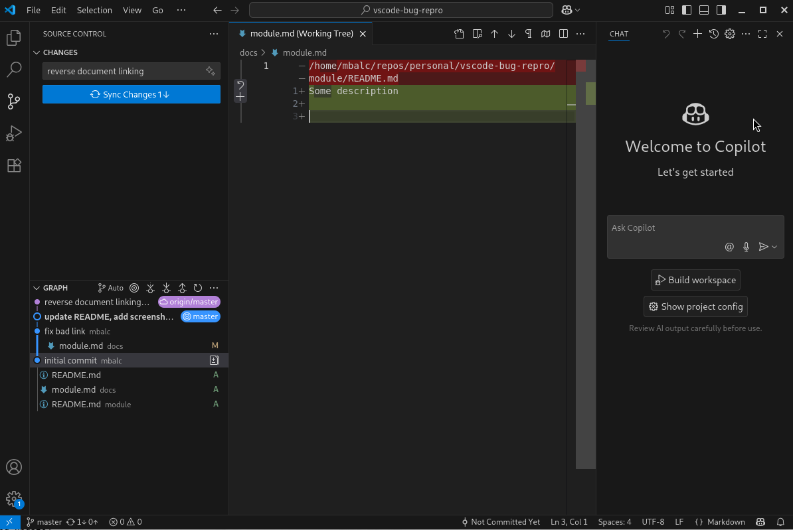
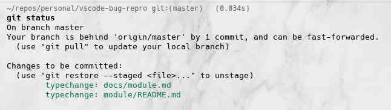

Issue https://github.com/microsoft/vscode/issues/258798

- a real-life reproduction example of a doc update that just happened for us,
- with a screenshot where VSCode contradicts itself

# To reproduce in VSCode:

- load my repo with easy reproduction -  https://github.com/mbalc/repro-vscode-bug,
- use "Undo Last Action" action (Source Control -> Changes (...) -> Commit -> Undo Last Commit

## Expected result:
show diff of the last commit, be able to commit with the button

## Actual result:
empty diff shows (no diff); 
you see "Sync changes" button instead of "Commit" (to re-undo)

